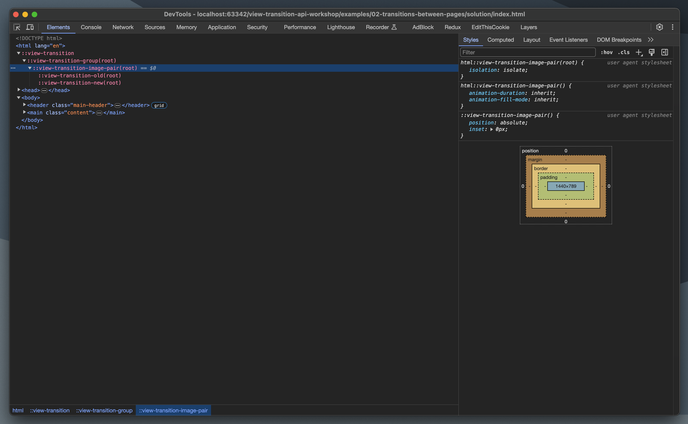
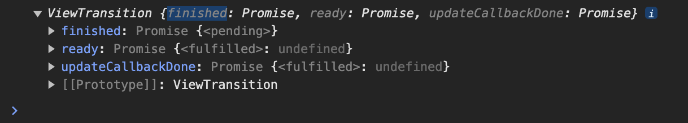

# 03 - API
This example do not have setup, and it is more theory.

## How these transitions work
https://developer.chrome.com/docs/web-platform/view-transitions/#how_these_transitions_work

When .startViewTransition() is called, the API captures the current state of the page. This includes taking a screenshot.

Once that's complete, the callback passed to .startViewTransition() is called. That's where the DOM is changed. Then, the API captures the new state of the page.

Once the state is captured, the API constructs a pseudo-element tree like this:

```
::view-transition
└─ ::view-transition-group(root)
   └─ ::view-transition-image-pair(root)
      ├─ ::view-transition-old(root)
      └─ ::view-transition-new(root)
```

The ::view-transition sits in an overlay, over everything else on the page. This is useful if you want to set a background color for the transition.

::view-transition-old(root) is a screenshot of the old view, and ::view-transition-new(root) is a live representation of the new view. Both render as CSS 'replaced content' (like an ).

The old view animates from opacity: 1 to opacity: 0, while the new view animates from opacity: 0 to opacity: 1, creating a cross-fade.

All of the animation is performed using CSS animations, so they can be customized with CSS.

## Check pseudoclasses in your code..



## What `startViewTransition` returns?
Let's try it..

```js
    const transition = document.startViewTransition(modifyRectPosition);
    console.log(transition)
```

what we get:


`const viewTransition = document.startViewTransition(updateCallback)`
- Start a new ViewTransition.
- `updateCallback` is called once the current state of the document is captured.

Then, when the promise returned by `updateCallback` fulfills, the transition begins in the next frame. If the promise returned by updateCallback rejects, the transition is abandoned.

### Instance members of `ViewTransition`:
`viewTransition.updateCallbackDone`
- A promise that fulfills when the promise returned by updateCallback fulfills, or rejects when it rejects.
- The View Transition API wraps a DOM change and creates a transition. However, sometimes you don't care about the success/failure of the transition animation, you just want to know if and when the DOM change happens. updateCallbackDone is for that use-case.

`viewTransition.ready`
- A promise that fulfills once the pseudo-elements for the transition are created, and the animation is about to start.
- It rejects if the transition cannot begin. This can be due to misconfiguration, such as duplicate view-transition-names, or if updateCallback returns a rejected promise.
- This is useful for animating the transition pseudo-elements with JavaScript.

`viewTransition.finished`
- A promise that fulfills once the end state is fully visible and interactive to the user.
- It only rejects if updateCallback returns a rejected promise, as this indicates the end state wasn't created.
- Otherwise, if a transition fails to begin, or is skipped during the transition, the end state is still reached, so finished fulfills.

`viewTransition.skipTransition()`
- Skip the animation part of the transition.
- This won't skip calling updateCallback, as the DOM change is separate to the transition.
