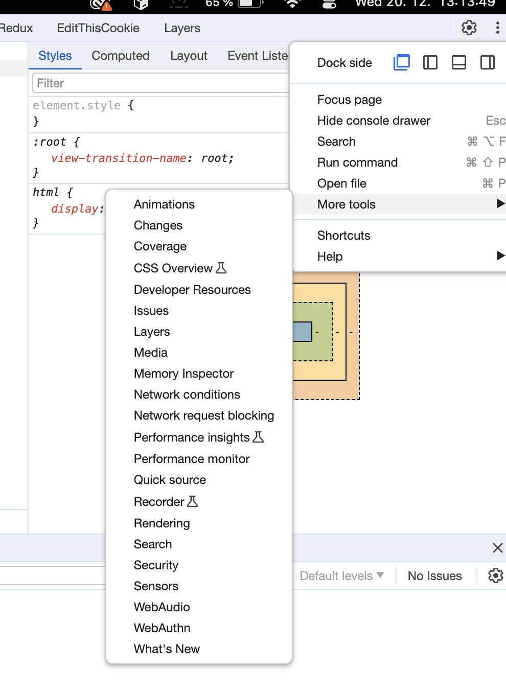

# 06 - Final

## Debug tools
animations debug tools works!

## Thank you
Thank you for reading and trying these examples. If you want know more I recommend this article:

https://developer.chrome.com/docs/web-platform/view-transitions/

and these examples:
https://glitch.com/edit/#!/simple-set-demos

